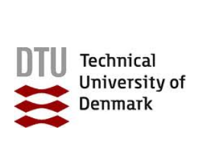

<p align="center">
  
  
</p>

# 🧬 Multi-omics Data Analysis

The **omics revolution** produces data faster than it produces understanding. Turning a
mass spectrometer's output into a biological claim takes a chain of decisions — how to
process, filter, normalise, test, annotate and integrate — and each link in that chain can
change the answer.

---

This **three-day intensive course** offers practical, up-to-date training in **data science
applied to omics data**, with a focus on **mass-spectrometry proteomics and metabolomics**
and on **multi-omics integration**.

The aim is to train researchers, bioinformaticians and health-science professionals to
manage the full path from raw instrument files to interpretable biology: processing
techniques, statistical analysis, visualisation, functional enrichment, integration of
several omics layers, and the application and visualisation of **biological networks**
derived from them.

What makes the course concrete is that it follows **one real cohort from start to finish**.
Every notebook, every plot and every exercise uses serum proteomics and metabolomics from
the same 45 septic patients, so by the end of Day 3 the class has built a complete
multi-omics story — including its uncertainties. All practical sessions are in **Python**,
in **Jupyter notebooks that run on Google Colab**; no local installation is required.

## Keywords

Proteomics, metabolomics, multi-omics integration, mass spectrometry, networks, Nextflow,
nf-core, Python, data science, reproducibility, open science.

---

## 🧫 The course dataset

> **He J, Luo S, Xu W, Chen Y, Liu G, Tang J, Yang Y, Zhao B, Ma L, Sheng H, Mao E.**
> *Serum proteomic profiling of sepsis patients reveals a protein-based diagnostic model,
> with metabolomic insights into carbapenem-resistant Klebsiella pneumoniae infection.*
> **Front Immunol. 2026;17:1818068.**
> [doi:10.3389/fimmu.2026.1818068](https://doi.org/10.3389/fimmu.2026.1818068)

Sepsis caused by **carbapenem-resistant *Klebsiella pneumoniae* (CRKP)** causes the death of roughly 20–40 % of patients, about twice the rate of a susceptible infection — but blood cultures and susceptibility testing take one to three days, and treatment cannot wait. The study asks whether the patient's **own** serum molecules can distinguish a resistant from a
susceptible infection on day 0.

| Group | n | Description |
|---|---|---|
| **Con** | 15 | Sepsis, all microbiological cultures negative |
| **CSKP** | 15 | Sepsis with confirmed carbapenem-**susceptible** *K. pneumoniae* (sample IDs `KP*`) |
| **CRKP** | 15 | Sepsis with confirmed carbapenem-**resistant** *K. pneumoniae* |

The **same 45 serum samples** were measured on two platforms, which is what makes the
integration on Day 3 possible rather than decorative:

| | Proteomics | Metabolomics |
|---|---|---|
| Repository | [PXD075261](https://proteomecentral.proteomexchange.org/) (ProteomeXchange / iProX) | [MTBLS14016](https://www.ebi.ac.uk/metabolights/MTBLS14016) (MetaboLights) |
| Instrument | timsTOF Pro (Bruker) | QTRAP 6500 (SCIEX) |
| Acquisition | diaPASEF, data-independent | MRM, widely targeted, ± ionisation |
| Processing | DIA-NN 1.9.2, library-free, MaxLFQ | Vendor MRM integration |
| Features | 1 458 protein groups | 1 073 named metabolites |
| Quality control | 3 pooled injections | 6 pooled injections |

Full documentation of the raw files, the curated tables and their provenance — including two
real data traps the class will meet — is in [`material/datasets.md`](material/datasets.md).

---

## 📅 Syllabus

> Each day now runs its own timetable (session content was rebalanced across days), so times are listed separately below. Day 1 keeps standard 30-minute coffee breaks; Days 2 and 3 use shortened 15-minute breaks to fit the compressed schedule. Lunch is 60 minutes on all days.

### Day 1

| Time | Session |
|---|---|
| 9:00–9:30 | [Introduction and Housekeeping](slides/01_Intro.pdf) |
| 9:30–10:00 | [From Omics to Multi-omics](https://docs.google.com/presentation/d/1ZU5wpnlEanIw0I-tX-U9MXesf0ddkbjAp56VHWiIlyk/edit?usp=sharing) |
| 10:00–10:30 | ☕ Coffee break |
| 10:30–11:00 | [Open Science](slides/02_open_science.pdf) |
| 11:00–11:30 | [Standardising Omics Workflows with Nextflow](https://docs.google.com/presentation/d/1Yb4V7lbIZXXZOUu0aVemfjxe3syo4sAugan0b_IwKBA/edit?usp=sharing) |
| 11:30–12:30 | 🍽️ Lunch |
| 12:30–13:30 | [Introduction to Python](https://colab.research.google.com/github/Multiomics-Analytics-Group/course_multi-omics_analysis/blob/main/notebooks/01_Introduction_to_Python/01_basics.ipynb) |
| 13:30–14:30 | [Working with Data in Python](https://colab.research.google.com/github/Multiomics-Analytics-Group/course_multi-omics_analysis/blob/main/notebooks/02_Working_with_Data_in_Python/02_pandas.ipynb) |
| 14:30–15:00 | ☕ Coffee break |
| 15:00–16:00 | [Visualizing Data in Python](https://colab.research.google.com/github/Multiomics-Analytics-Group/course_multi-omics_analysis/blob/main/notebooks/04_Visualizing_Data_in_Python/05_viz.ipynb) |

### Day 2

| Time | Session |
|---|---|
| 9:00–10:00 | [Omics: Proteomics and Metabolomics](slides/04_Omics_Proteomics_and_Metabolomics.pptx) |
| 10:00–11:30 | [Preprocessing Proteomics with quantms/DIA-NN](https://colab.research.google.com/github/Multiomics-Analytics-Group/course_multi-omics_analysis/blob/main/proteomics/notebooks/01_proteomics_preprocessing_quantmsdiann.ipynb) |
| 11:30–11:45 | ☕ Coffee break |
| 11:45–13:15 | [Preprocessing Metabolomics with nf-core/metaboigniter](https://colab.research.google.com/github/Multiomics-Analytics-Group/course_multi-omics_analysis/blob/main/metabolomics/notebooks/01_metabolomics_preprocessing_metaboigniter.ipynb) |
| 13:15–14:15 | 🍽️ Lunch |
| 14:15–16:00 | [Proteomics Basic Analysis](https://colab.research.google.com/github/Multiomics-Analytics-Group/course_multi-omics_analysis/blob/main/proteomics/notebooks/02_proteomics_analysis.ipynb) |

### Day 3

| Time | Session |
|---|---|
| 9:00–9:30 | [Metabolomics Basic Analysis](https://colab.research.google.com/github/Multiomics-Analytics-Group/course_multi-omics_analysis/blob/main/metabolomics/notebooks/02_metabolomics_analysis.ipynb) |
| 9:30–10:00 | [Introduction to Networks in Python](https://colab.research.google.com/github/Multiomics-Analytics-Group/course_multi-omics_analysis/blob/main/notebooks/05_Visualising_Networks/03_nx.ipynb) |
| 10:00–10:15 | ☕ Coffee break |
| 10:15–10:45 | [Networks in Python — Co-abundance Practical](https://colab.research.google.com/github/Multiomics-Analytics-Group/course_multi-omics_analysis/blob/main/notebooks/05_Visualising_Networks/04_nxpandas.ipynb) |
| 10:45–11:15 | [Visualising Networks — Cytoscape](material/cytoscape.md) |
| 11:15–12:15 | 🍽️ Lunch |
| 12:15–13:15 | [Multi-omics](https://docs.google.com/presentation/d/1xbuNIp87tWDQmaQDzW9EzzN6lJVNWfsY3wbTByngbEI/edit?usp=sharing) |
| 13:15–14:45 | [Multi-omics I — Integration](https://colab.research.google.com/github/Multiomics-Analytics-Group/course_multi-omics_analysis/blob/main/multiomics/notebooks/01_multiomics_integration.ipynb) |
| 14:45–15:00 | ☕ Coffee break |
| 15:00–16:00 | [Multi-omics II — Networks and pathways](https://colab.research.google.com/github/Multiomics-Analytics-Group/course_multi-omics_analysis/blob/main/multiomics/notebooks/02_multiomics_networks.ipynb) |

### The thread through the three days

**Day 1 — from instrument to fundamentals.** What the machines measure and why a workflow
manager is not optional, then a hands-on foundation in Python and pandas, followed by
visualisation — all taught *on the course data*.

**Day 2 — from raw files to result.** Two Nextflow pipelines run hands-on:
[quantmsdiann](https://quantmsdiann.quantms.org/) for DIA proteomics and
[nf-core/metaboigniter](https://nf-co.re/metaboigniter/2.0.1/) for untargeted metabolomics —
then a full differential-abundance analysis of the serum proteome with
[acore](https://analytics-core.readthedocs.io/),
[vuecore](https://vuecore.readthedocs.io/) and
[vuegen](https://vuegen.readthedocs.io/) — including a side-by-side comparison with the
published protein list.

**Day 3 — from result to biology.** The metabolome, then integration: similarity network
fusion and MOFA, a cross-omics correlation network exported to Cytoscape, a joint KEGG
pathway analysis, and a close look at the methionine cycle — the point where the two layers
actually meet.

---

## 💻 How to run the notebooks

Every hands-on session is a Jupyter notebook that opens in **Google Colab** with one click
on the links above — nothing to install, and the data are downloaded from this repository at
run time.

To work locally instead:

```bash
git clone https://github.com/Multiomics-Analytics-Group/course_multi-omics_analysis.git
cd course_multi-omics_analysis
pip install -r requirements.txt
jupyter lab
```

Two sessions need more than Python:

- **Nextflow pipelines** (Day 2 morning) need Java, Nextflow and a container engine. The
  notebooks install them and detect what is available; see
  [`material/nextflow_setup.md`](material/nextflow_setup.md) for what to do when a Colab
  runtime will not cooperate.
- **Cytoscape** (Day 3 morning) is a desktop application — install it beforehand from
  [cytoscape.org](https://cytoscape.org/). Instructions: [`material/cytoscape.md`](material/cytoscape.md).

---

## 📁 What is in this repository

```
├── metadata/                  clinical and sample metadata for the 45 patients
├── proteomics/
│   ├── data/                  protein matrix, annotation, SDRF, published results
│   └── notebooks/             preprocessing (quantms/DIA-NN) and analysis
├── metabolomics/
│   ├── data/                  metabolite matrix, annotation, published results
│   └── notebooks/             preprocessing (metaboigniter) and analysis
├── multiomics/
│   ├── data/                  published integrated pathway analysis
│   └── notebooks/             integration (SNF, MOFA) and networks
├── notebooks/                 Python, pandas, visualisation and network sessions
├── slides/                    lecture slides
├── material/                  dataset documentation and session instructions
├── publication/               the paper and its supplementary tables
├── bin/                       scripts that build the curated tables and the notebooks
├── cheat_sheets/              printable references for Python and its libraries
└── figures/                   logos and images
```

---

## 📚 Further resources

### References

1. He J, *et al.* [Serum proteomic profiling of sepsis patients reveals a protein-based diagnostic model, with metabolomic insights into carbapenem-resistant Klebsiella pneumoniae infection](https://doi.org/10.3389/fimmu.2026.1818068). *Front Immunol.* 2026;17:1818068. — **the course dataset**
2. Langer BE, *et al.* [Empowering bioinformatics communities with Nextflow and nf-core](https://pubmed.ncbi.nlm.nih.gov/40731283/). *Nat Methods.* 2025. [resource](https://nf-co.re/)
3. Dai C, *et al.* [quantms: a cloud-based pipeline for quantitative proteomics enables the reanalysis of public proteomics data](https://www.nature.com/articles/s41592-024-02343-1). *Nat Methods.* 2024;21:1603–1607. [resource](https://quantmsdiann.quantms.org/)
4. Demichev V, *et al.* [DIA-NN: neural networks and interference correction enable deep proteome coverage in high throughput](https://www.nature.com/articles/s41592-019-0638-x). *Nat Methods.* 2020;17:41–44.
5. Meier F, *et al.* [diaPASEF: parallel accumulation–serial fragmentation combined with data-independent acquisition](https://www.nature.com/articles/s41592-020-00998-0). *Nat Methods.* 2020;17:1229–1236.
6. Dai C, *et al.* [A proteomics sample metadata representation for multiomics integration and big data analysis](https://www.nature.com/articles/s41467-021-26111-3). *Nat Commun.* 2021;12:5854. — the **SDRF** standard.
7. nf-core/metaboigniter. [resource](https://nf-co.re/metaboigniter/2.0.1/)
8. Broadhurst D, *et al.* [Guidelines and considerations for the use of system suitability and quality control samples in mass spectrometry assays](https://pubmed.ncbi.nlm.nih.gov/29805354/). *Metabolomics.* 2018;14:72.
9. Dunn WB, *et al.* [Procedures for large-scale metabolic profiling of serum and plasma using gas and liquid chromatography coupled to mass spectrometry](https://pubmed.ncbi.nlm.nih.gov/21543848/). *Nat Protoc.* 2011;6:1060–1083.
10. Wang B, *et al.* [Similarity network fusion for aggregating data types on a genomic scale](https://www.nature.com/articles/nmeth.2810). *Nat Methods.* 2014;11:333–337. [resource](https://github.com/rmarkello/snfpy)
11. Argelaguet R, *et al.* [Multi-Omics Factor Analysis — a framework for unsupervised integration of multi-omics data sets](https://www.embopress.org/doi/full/10.15252/msb.20178124). *Mol Syst Biol.* 2018;14:e8124. [resource](https://biofam.github.io/MOFA2/)
12. Cantini L, *et al.* [Benchmarking joint multi-omics dimensionality reduction approaches for the study of cancer](https://www.nature.com/articles/s41467-020-20430-7). *Nat Commun.* 2021;12:124.
13. Baião AR, *et al.* [A technical review of multi-omics data integration methods: from classical statistical to deep generative approaches](https://academic.oup.com/bib/article/26/4/bbaf355/8220754). *Brief Bioinform.* 2025;26:bbaf355.
14. Shannon P, *et al.* [Cytoscape: a software environment for integrated models of biomolecular interaction networks](https://pubmed.ncbi.nlm.nih.gov/14597658/). *Genome Res.* 2003;13:2498–2504. [resource](https://cytoscape.org/)
15. Timmons JA, *et al.* [Multiple sources of bias confound functional enrichment analysis of global -omics data](https://pubmed.ncbi.nlm.nih.gov/26346307/). *Genome Biol.* 2015;16:186.
16. Wishart DS, *et al.* [HMDB 5.0: the Human Metabolome Database for 2022](https://pubmed.ncbi.nlm.nih.gov/34986597/). *Nucleic Acids Res.* 2022;50:D622–D631. [resource](https://hmdb.ca/)
17. Kanehisa M, *et al.* [KEGG: integrating viruses and cellular organisms](https://pubmed.ncbi.nlm.nih.gov/33125081/). *Nucleic Acids Res.* 2021;49:D545–D551. [resource](https://www.kegg.jp/)

### Tools developed at DTU Biosustain / NNF BRIGHT

- [**acore**](https://analytics-core.readthedocs.io/) — analytical core: filtering, imputation, normalisation, statistics, enrichment and network analysis for omics data
- [**vuecore**](https://vuecore.readthedocs.io/) — visualisation components
- [**vuegen**](https://vuegen.readthedocs.io/) — turn a folder of results into a navigable report

### Extra notebooks

Not part of the three-day schedule, but useful for your own projects:

- [Gene Ontology API](https://colab.research.google.com/github/Multiomics-Analytics-Group/course_multi-omics_analysis/blob/main/notebooks/03_Databases_and_Data_Annotation/05_go_api.ipynb)
- [UniProt API](https://colab.research.google.com/github/Multiomics-Analytics-Group/course_multi-omics_analysis/blob/main/notebooks/03_Databases_and_Data_Annotation/06_uniprot_api.ipynb)

### Cheat sheets

- Basics: [Getting started](cheat_sheets/cheat_sheet_day0.pdf) · [Importing data](cheat_sheets/Importing_Data_Cheat_sheet.pdf) · [Jupyter](cheat_sheets/Jupyter_Notebook_Cheat_Sheet.pdf)
- Data science: [NumPy](cheat_sheets/Numpy_Python_Cheat_Sheet.pdf) · [pandas](cheat_sheets/Pandas_Cheat_Sheet.pdf) · [SciPy](cheat_sheets/Scipy-LinearAlgebra_Cheat_Sheet.pdf) · [scikit-learn](cheat_sheets/Scikit-learn_Cheat_Sheet.pdf)
- Visualisation: [Matplotlib](cheat_sheets/Python_Matplotlib_Cheat_Sheet.pdf) · [Plotly](cheat_sheets/Plotly_Cheat_Sheet.pdf) · [Seaborn](cheat_sheets/Seaborn_Cheat_Sheet.pdf) · [Bokeh](cheat_sheets/Bokeh_Cheat_Sheet.pdf)

### Learning Python from scratch

- [learnpython.org](https://www.learnpython.org/) — interactive introduction
- [Scipy Lectures](https://scipy-lectures.org/) — Python for scientific computing
- [The official tutorial](https://docs.python.org/3/tutorial/)
- [Google Colab tutorials](https://www.youtube.com/playlist?list=PLQY2H8rRoyvyK5aEDAI3wUUqC_F0oEroL) — the environment we use

---

## Acknowledgements

The Python and network notebooks build on material from the
[Multiomics Analytics Group](https://github.com/Multiomics-Analytics-Group) courses
*Using Networks to Study Microbes* and *Omics Data Analysis*, and some of them were
originally inspired by [Python Tsunami](https://github.com/Center-for-Health-Data-Science/PythonTsunami)
at the [Center for Health Data Science](https://heads.ku.dk/), University of Copenhagen.

The proteomics and metabolomics analysis sessions build on the
[Data Science Platform](https://bright.dtu.dk/technologies/biofoundry/informatics) courses
[dsp_course_proteomics_intro](https://github.com/biosustain/dsp_course_proteomics_intro) and
[dsp_course_metabolomics_intro](https://github.com/biosustain/dsp_course_metabolomics_intro).

We thank He *et al.* for depositing both omics layers of their cohort publicly.
